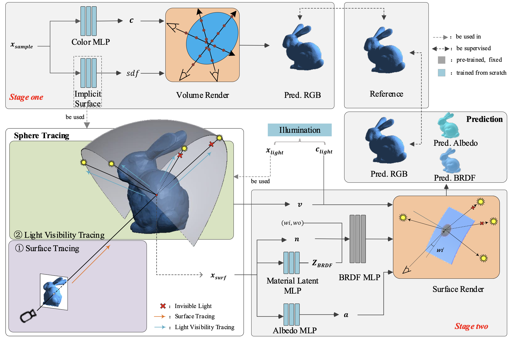
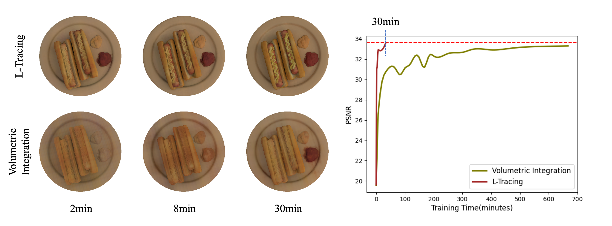
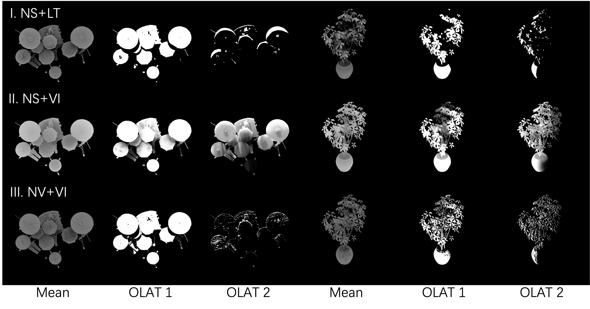

# L-Tracing

This is the official PyTorch implementation of our proposed framework for surface reconstruction and reflectance decomposition.

The framework is designed based on [L-Tracing: Fast Light Visibility Estimation on Neural Surfaces by Sphere Tracing](https://www.ecva.net/papers/eccv_2022/papers_ECCV/papers/136750214.pdf) [ECCV'22]



## Features

- Our L-Tracing based reflectance factorization framework adapted from [NeRFactor](https://arxiv.org/pdf/2106.01970.pdf) produces photo-realistic novel view images with nearly 10x speedup, compared with the same framework applying volumetric integration for light visibility estimation.

  

- L-Tracing respects the solid object surface and the binary geometry occlusions, as a result, our framework produces sharper shadows and specular.

  

  **I. NS+LT**: L-Tracing on Neural Surface, our proposed framework based on L-Tracing.

  **II. NS+VI**: Volume Integration on Neural Surface, based on SDF shape representation, convert signed distance to density for volume integration.

  **III. NV+VI**: Volume Integration on Neural Volume, based on neural volume representation, directly apply volumetric integration on neural volumes.
  

## Getting started [WIP]

In the near future, we will release the code and trained models.

## BibTeX

```
@inproceedings{chen2022tracing,
  title={L-Tracing: Fast Light Visibility Estimation on Neural Surfaces by Sphere Tracing},
  author={Chen, Ziyu and Ding, Chenjing and Guo, Jianfei and Wang, Dongliang and Li, Yikang and Xiao, Xuan and Wu, Wei and Song, Li},
  booktitle={Proceedings of the European Conference on Computer Vision (ECCV)},
  year={2022}
}
```

