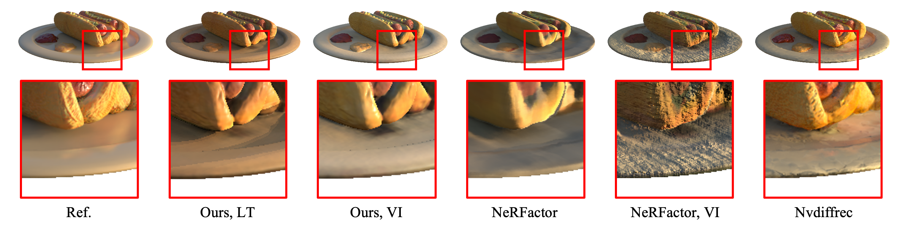

# L-Tracing

This is the official PyTorch implementation of our proposed framework for surface reconstruction and reflectance decomposition.

The framework is designed based on [L-Tracing: Fast Light Visibility Estimation on Neural Surfaces by Sphere Tracing](https://www.ecva.net/papers/eccv_2022/papers_ECCV/papers/136750214.pdf) [ECCV'22]


## Features

- Our L-Tracing based reflectance factorization framework adapted from [NeRFactor](https://arxiv.org/pdf/2106.01970.pdf) produces photo-realistic novel view images with nearly 10x speedup, compared with the same framework applying volumetric integration for light visibility estimation.

  

- L-Tracing respects the solid object surface and the binary geometry occlusions, as a result, our framework produces sharper shadows and specular.

  

  **I. NS+LT**: L-Tracing on Neural Surface, our proposed framework based on L-Tracing.

  **II. NS+VI**: Volume Integration on Neural Surface, based on SDF shape representation, convert signed distance to density for volume integration.

  **III. NV+VI**: Volume Integration on Neural Volume, based on neural volume representation, directly apply volumetric integration on neural volumes.
  
- We show the details of relighting with a novel environment illumination. 

  

## Installation

- python>=3.6 

- pytorch>=1.6.0
- `pip install tqdm scikit-image opencv-python pandas tensorboard addict imageio imageio-ffmpeg pyquaternion scikit-learn pyyaml seaborn PyMCubes trimesh plyfile deepdish`

## Download

#### DTU

wget this [[link]](https://www.dropbox.com/s/ujmakiaiekdl6sh/DTU.zip ) according to IDR to download the DTU dataset.

```shell
wget https://www.dropbox.com/s/ujmakiaiekdl6sh/DTU.zip 
```

#### NeRF Synthetic

From NeRFactor [[project page]](https://xiuming.info/projects/nerfactor/), download the NeRF Synthetic dataset from google drive [[link]](https://drive.google.com/drive/folders/1-9HhqWwJhTBjUZqttLafKo72fNl4sB5E).

Download all .zip files in  `rendered_images/`, unzip them and put them to `/data/nerf_synthetic`.

#### NeRF Real

From the [[link]](https://drive.google.com/drive/folders/1-9HhqWwJhTBjUZqttLafKo72fNl4sB5E). Download all .zips file in  `real_images/`, unzip them to `/data/nerf_real`.

#### HDR Light Probes

From the [[link]](https://drive.google.com/drive/folders/1-9HhqWwJhTBjUZqttLafKo72fNl4sB5E). Download HDR light probes `light-probes.zip` , for novel light relighting.

#### Data Structure

The downloaded files are supposed to be put under the folder `/data`.

```
├── data
    ├── nerf_synthetic
    │   ├── drums
    │   ├── ficus
    │   ├── ...
    ├── nerf_real
    │   ├── pinecone
    │   ├── vasedeck
    ├── dtu
    │   ├── dtu_110
    │   ├── dtu_114
    │   ├── ...
    ├── light-probe
    │   ├── test
    │   │   ├── ...
```

## Running

#### stage1 shape reconstruction

Run `train_shape.sh` for NeuS shape reconstruction.

Please refer to `./config/surfrecon.yaml` for settings.

```bash
python train.py --config ./config/surfrecon.yaml
```

#### Stage2 Reflectance Decomposition

Run `train_surf.sh` for our **L-Tracing based** surface reflectance decomposition.

Please refer to `./config/surfactor.yaml` for settings. (lego for example)

```bash
shape_ckpt_path=./logs/lego_shape/ckpts/latest.pt # the path to the trained shape ckpt

python train.py --config ./config/surfactor.yaml --training:ckpt_file $shape_ckpt_path
```

#### Evaluation and Relighting

Run `test.sh` to generate visualizations of the RGB image and albedo in novel views, as well as rendering results with novel light source (light probes, or your own images as environment map).

```bash
test_cfg_path=./logs/lego_surf/config.yaml
val_downscale=1

python test.py --config $test_cfg_path --data:val_downscale $val_downscale
```

## Acknowledgements

This repository is mainly built on the basis of neurecon(@[ventusff](https://github.com/ventusff)), welcome everyone to follow and star https://github.com/ventusff/neurecon.

This repository borrows a lot from the official implementation of NeRFactor: https://github.com/google/nerfactor. Thanks to the author for their inspiring work.


## BibTeX

```
@inproceedings{chen2022tracing,
  title={L-Tracing: Fast Light Visibility Estimation on Neural Surfaces by Sphere Tracing},
  author={Chen, Ziyu and Ding, Chenjing and Guo, Jianfei and Wang, Dongliang and Li, Yikang and Xiao, Xuan and Wu, Wei and Song, Li},
  booktitle={Proceedings of the European Conference on Computer Vision (ECCV)},
  year={2022}
}
```

